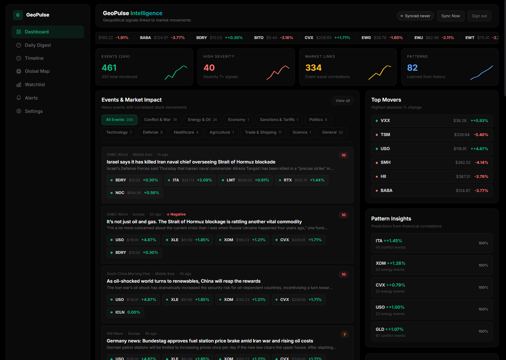
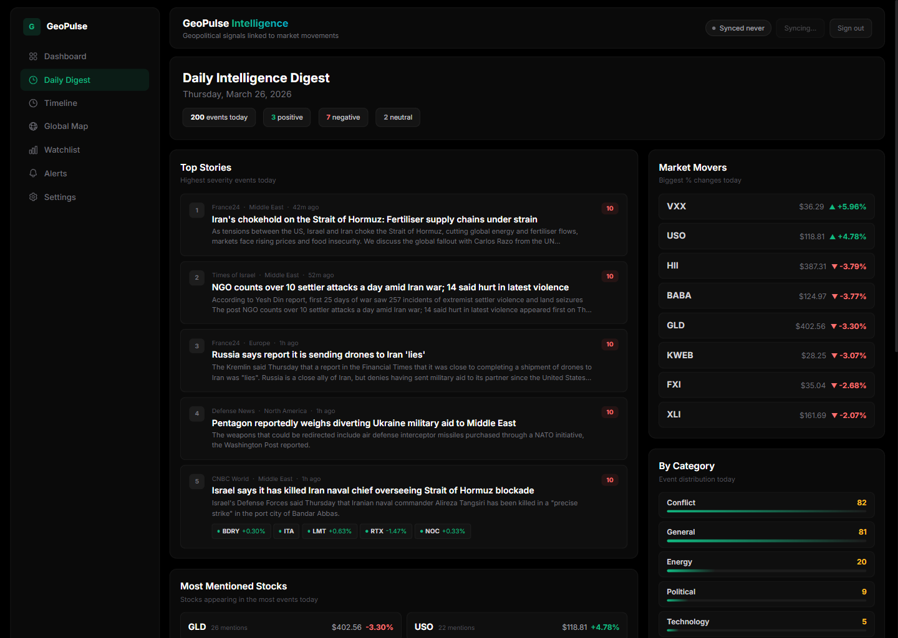
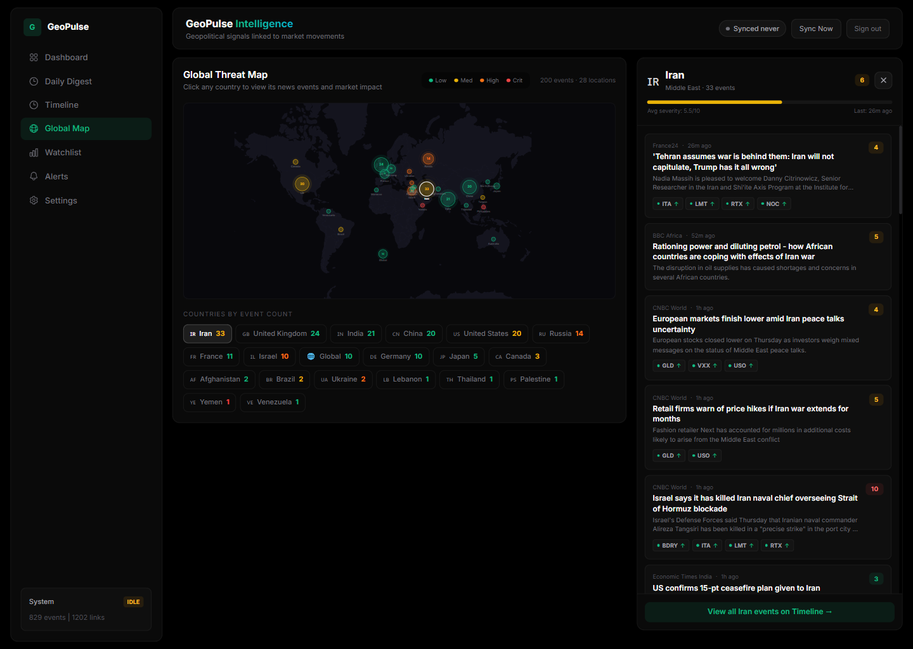
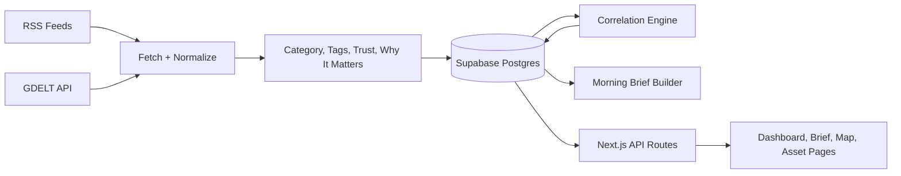

# GeoPulse

GeoPulse is a geopolitical intelligence product for finance-curious investors. It tracks breaking world events, explains why they matter, connects them to affected assets, and turns the result into a dashboard, morning brief, saved views, watchlists, alerts, and trust-oriented event detail pages.

[Live App](https://geopolitics-finance-dashboard.vercel.app) | [Setup Guide](docs/setup-guide.md) | [API Reference](docs/api-reference.md) | [Architecture](docs/architecture.md) | [Stripe Billing Guide](docs/billing-guide.md)

## Screenshots

### Dashboard



### Morning Brief



### Global Map



## Product Focus

GeoPulse is built around one core job:

> Understand what happened, why markets care, and what to watch next.

The current product is optimized for:

- high-signal geopolitical event tracking
- finance-first market context instead of generic news browsing
- fast trust checks through source count, related coverage, and freshness labels
- habit-forming workflows such as a morning brief and reusable saved views
- a public preview that proves the product before signup

## What Is Implemented

- Dashboard with server-side filters for search, date/time window, region, category, severity, symbols, and market direction
- Anonymous homepage preview with live high-signal stories, hotspots, and market snapshot cards
- Preview ranking that now prioritizes clearer confirmation and stronger market relevance instead of raw headline volume
- Morning Brief page with personalized ranking based on user preferences and plan limits
- Saved views backed by durable `SavedFilter` records instead of temporary local UI state
- Free-vs-premium entitlement scaffolding with a real anonymous preview, free core workflow, and Stripe checkout, portal, and webhook routes
- Watchlist and alert limits enforced from entitlements instead of UI-only messaging
- Event trust metadata including duplicate coverage, source count, source reliability, confidence badges, and plain-English "why it matters"
- Quote provider abstraction with delayed-provider support and persistent snapshot fallback
- Per-symbol quote gap filling from stored snapshots so missing provider symbols do not degrade to fake zero prices
- Source health and staged ingestion jobs for operational visibility
- Status API normalization so `lastJob` cannot contradict a newer successful `lastIngestion`
- Lightweight signup abuse controls: distributed rate limiting, honeypot detection, minimum form dwell time, and required Cloudflare Turnstile verification in production
- Unit tests for trust, intelligence, and cron auth helpers via `npm test`
- Beta smoke script for the public launch path (`npm run smoke:beta`)

## Stack

- Next.js 16 Pages Router
- React 18 + TypeScript
- Prisma ORM
- Supabase PostgreSQL
- Supabase Auth with server-side session cookies
- Tailwind CSS
- SWR
- TradingView embeds
- Vercel deployment and cron entrypoints

## Architecture



## Getting Started

```bash
git clone https://github.com/Sasidhar-7302/Geopolitics_Finance_Dashboard.git
cd Geopolitics_Finance_Dashboard
npm install
cp .env.example .env
npx prisma migrate deploy
npm run dev
```

Open `http://localhost:3000`.

## Required Environment Variables

| Variable | Required | Description |
|---|---|---|
| `DATABASE_URL` | Yes | Supabase pooled runtime connection, usually port `6543` |
| `DIRECT_URL` | Yes | Supabase direct/session migration connection, usually port `5432` |
| `APP_URL` | Yes | Public app URL used for billing links and scheduler callbacks |
| `NEXT_PUBLIC_SUPABASE_URL` | Yes | Supabase project URL |
| `NEXT_PUBLIC_SUPABASE_PUBLISHABLE_KEY` | Yes | Supabase browser auth key |
| `SUPABASE_SERVICE_ROLE_KEY` | Yes | Server-side key for auth-user creation and legacy-account migration |
| `CRON_SECRET` | Yes | Protects cron entrypoints |

## Optional Environment Variables

| Variable | Purpose |
|---|---|
| `ADMIN_EMAILS` | Comma-separated admin allowlist for manual sync and admin digest actions |
| `NEWS_RSS_FEEDS` | Override feed list without editing `config/feeds.json` |
| `GDELT_QUERY` | Custom GDELT query string |
| `TWELVEDATA_API_KEY` | Preferred provider-backed quote source |
| `NEXT_PUBLIC_TURNSTILE_SITE_KEY` | Required for production/public-beta signup verification |
| `TURNSTILE_SECRET_KEY` | Required for production/public-beta signup verification |
| `STRIPE_SECRET_KEY` | Enables Stripe billing routes |
| `STRIPE_PRICE_ID_MONTHLY` | Monthly premium plan price |
| `STRIPE_PRICE_ID_YEARLY` | Yearly premium plan price |
| `STRIPE_WEBHOOK_SECRET` | Stripe webhook verification |

## Product Access Model

- Anonymous users get a live preview on the homepage with top stories, hotspots, and delayed market snapshots
- Free accounts get the full core workflow: dashboard, digest, timeline, map, event drill-downs, 1 watchlist, 3 alerts, 3 saved views, and 5 digest stories
- Premium is positioned at `$8/month` or `$79/year` for unlimited alerts, unlimited watchlists and saved views, faster refresh, and deeper briefing workflows
- The first `1,000` registered users are still treated as the founding beta cohort, but beta status no longer silently grants unlimited premium access to everyone
- Billing plan changes are server-controlled only. Client preference updates can read plan state, but they cannot grant premium access.

## Deployment Notes

- Vercel Hobby-compatible cron is configured for once-daily ingestion in `vercel.json`
- Cron entrypoints accept header-based bearer auth only; query-string secrets are intentionally rejected
- Hourly timezone-aware digest processing is implemented in `/api/cron/digests`, and the handler now supports both `GET` and `POST` so it can work with Vercel cron if you enable it later
- Public preview APIs are cache-backed and rate-limited through Postgres-backed distributed throttles to reduce scraping pressure and provider quota burn
- Production signup now expects Turnstile to be configured before public beta traffic is opened
- Run `npx prisma migrate deploy` before the first production rollout
- In production, set `ADMIN_EMAILS`. If you leave it unset, admin-only routes are intentionally denied

## Launch Checks

```bash
npm run security:secrets
npm run lint
npm test
npm run build
npm run smoke:beta
```

Run the smoke script against a local or deployed production build by setting `BASE_URL`.

## Core API Surface

| Method | Endpoint | Purpose |
|---|---|---|
| `GET` | `/api/events` | Server-side filtered event feed with cursor pagination |
| `GET` | `/api/events/[id]` | Event detail with trust metadata and related coverage |
| `GET` | `/api/markets/quotes` | Market quotes through provider abstraction and snapshot fallback |
| `GET` | `/api/me/entitlements` | Current plan state, features, and limits |
| `GET/POST/DELETE` | `/api/saved-filters` | Durable saved dashboard views |
| `POST` | `/api/digests/send` | Generate a preview or simulated personalized digest |
| `POST` | `/api/billing/checkout` | Create Stripe subscription checkout session |
| `POST` | `/api/billing/portal` | Open Stripe billing portal |
| `GET/POST` | `/api/cron/ingest` | Scheduled ingestion entrypoint |
| `GET/POST` | `/api/cron/digests` | Scheduled morning-brief processing entrypoint |

## Project Structure

```text
prisma/
  migrations/                Prisma migrations
  schema.prisma              Source of truth for data models
docs/
  api-reference.md           Route contracts
  architecture.md            Runtime structure and responsibilities
  correlation-engine.md      Asset-matching logic
  data-pipeline.md           Ingestion stages and reliability notes
  database-schema.md         Data model reference
  market-data.md             Quote-provider strategy
  setup-guide.md             Local and Vercel deployment guide
  images/                    README screenshots
src/
  components/                UI components
  lib/                       Auth, ingest, filtering, digest, billing, market data
  pages/                     Next.js pages and API routes
```

## Documentation

- [Security](SECURITY.md)
- [Architecture](docs/architecture.md)
- [Setup Guide](docs/setup-guide.md)
- [API Reference](docs/api-reference.md)
- [Stripe Billing Guide](docs/billing-guide.md)
- [Database Schema](docs/database-schema.md)
- [Go-To-Market](docs/go-to-market.md)
- [Data Pipeline](docs/data-pipeline.md)
- [Correlation Engine](docs/correlation-engine.md)
- [Market Data](docs/market-data.md)
- [Sentiment Analysis](docs/sentiment-analysis.md)
- [Pattern Learning](docs/pattern-learning.md)
- [Frontend Guide](docs/frontend-guide.md)

## License

All Rights Reserved.
