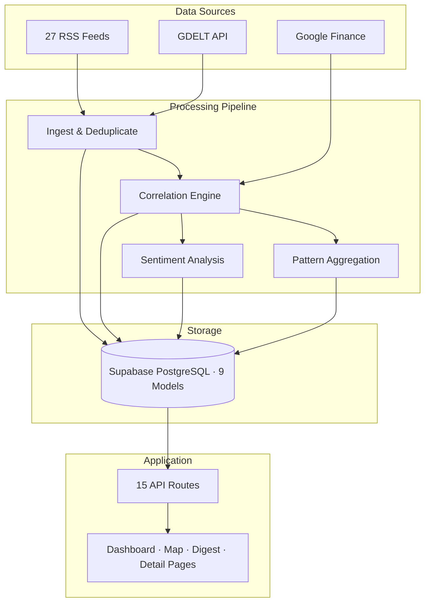
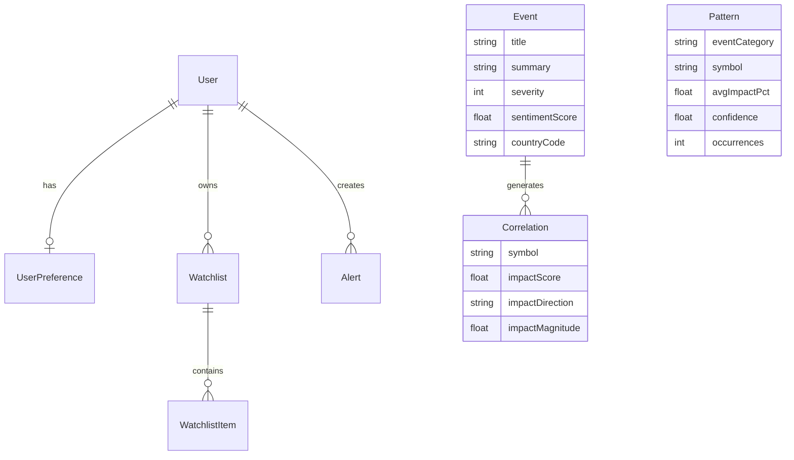

# GeoPulse Intelligence

**Geopolitical-finance intelligence for everyone.** GeoPulse connects world events to market movements in real time — helping you understand what's happening, why it matters, and which assets are affected.

Built for analysts, investors, and curious minds who want Bloomberg-level insight without the Bloomberg price tag. Entirely self-hosted. Zero API costs.

---

## The Problem

Geopolitical events move markets every day. When OPEC cuts oil output, energy stocks surge. When trade tensions escalate, semiconductor ETFs drop. But connecting the dots between world events and market impact requires expensive terminals, fragmented news sources, and domain expertise.

**GeoPulse solves this.** It automatically ingests news from 27 RSS feeds across 7 regions plus GDELT, identifies which financial instruments are affected, measures sentiment, and learns patterns over time — all presented through an intuitive intelligence dashboard.

---

## How It Works

GeoPulse runs a continuous intelligence pipeline:

```
News Sources (27 RSS feeds + GDELT)
        |
        v
   Ingestion Engine ──> Deduplicate by URL ──> Store events
        |
        v
   Correlation Engine ──> Match against 113 keyword-symbol mappings
        |                  using word-boundary regex (no false positives)
        |
        v
   Pattern Learner ──> Aggregate historical correlations
        |               Calculate confidence scores
        |
        v
   Sentiment Analyzer ──> VADER scoring (-1.0 to +1.0)
        |                  Positive / Negative / Neutral
        |
        v
   Dashboard ──> Real-time UI with TradingView charts
                 Per-country world map
                 Personalized "For You" feed
```

**Example:** An article about OPEC production cuts triggers the correlation engine. It matches the keyword `oil` (with word-boundary regex, so "turmoil" is ignored), maps it to USO, XLE, XOM, CVX, fetches live prices from Google Finance, and creates correlations with direction and magnitude. Over time, the pattern learner aggregates similar events into repeatable directional signals.

---

## Features

**Intelligence Dashboard** — 16 filterable categories (Conflict, Energy, Economic, Technology, Trade, Healthcare, Climate, Defense, Cybersecurity, Nuclear, Agriculture, Shipping, Elections, Sanctions, Science, General). Severity-scored events with sentiment badges. Personalized "For You" feed based on your interests.

**Correlation Engine** — 113 keyword-to-symbol mappings across 11 categories. Word-boundary regex matching prevents false positives (e.g., "turmoil" does not match "oil"). Bidirectional navigation lets you go from an event to its affected stocks, or from a stock to all related news.

**Interactive World Map** — Per-country markers sized by event count and colored by severity. Click any country to see its events and which stocks they affect. Covers 40+ countries with coordinate mapping.

**Pattern Learning** — The system learns from historical correlations. Each pattern tracks average impact, direction, confidence, and occurrence count. Confidence is calculated as `min(1.0, occurrences/20 * directionConsistency)` — requiring both data volume and directional agreement. New events receive predictions based on these learned patterns.

**TradingView Charts** — Professional candlestick charts on stock detail pages and mini charts on event pages. Embedded TradingView widgets with real-time data at no cost.

**Sentiment Analysis** — VADER (Valence Aware Dictionary and sEntiment Reasoner) runs locally with no API key or cloud dependency. Scores each event from -1.0 to +1.0 and classifies as positive, negative, or neutral. Processes up to 200 events per ingestion cycle.

**Onboarding** — Three-step interest picker inspired by Perplexity. Choose your topics, regions, and stocks. The dashboard then prioritizes events matching your preferences.

**Daily Digest** — Auto-generated summary with top stories, most-mentioned stocks, market movers, category breakdowns, and sentiment distribution.

---

## Tech Stack

- **Framework:** Next.js 16 (Pages Router), React 18, TypeScript
- **Database:** Prisma ORM with Supabase PostgreSQL (9 models)
- **Auth:** NextAuth v4 with JWT strategy and credentials provider
- **Styling:** Tailwind CSS with custom dark theme
- **Data Fetching:** SWR with auto-refresh intervals
- **Charts:** TradingView embedded widgets
- **Map:** react-simple-maps
- **Sentiment:** VADER (vader-sentiment, local)
- **Market Data:** Google Finance HTML scraping (50+ symbols)
- **News:** 27 RSS feeds via rss-parser + GDELT API

---

## Getting Started

```bash
git clone https://github.com/Sasidhar-7302/Geopolitics_Finance_Dashboard.git
cd Geopolitics_Finance_Dashboard
npm install
cp .env.example .env       # Fill in your Supabase connection strings
npx prisma generate
npx prisma db push
npm run dev
```

Open `http://localhost:3000`. Sign up, complete onboarding, and trigger your first sync from Settings.

### Environment Variables

| Variable | Required | Description |
|---|---|---|
| `DATABASE_URL` | Yes | Supabase pooler connection string (port 6543) |
| `DIRECT_URL` | Yes | Supabase direct connection string (port 5432) |
| `NEXTAUTH_SECRET` | Yes | Random secret for JWT (`openssl rand -base64 32`) |
| `NEXTAUTH_URL` | Yes | `http://localhost:3000` locally, deployed URL on Vercel in production |
| `CRON_SECRET` | Recommended | Token for the cron ingestion endpoint |

### Vercel + Supabase

1. Set `DATABASE_URL` to the Supabase transaction pooler string on port `6543`.
2. Set `DIRECT_URL` to the Supabase session/direct string on port `5432`.
3. Set `NEXTAUTH_URL` to your deployed domain, for example `https://your-project.vercel.app`.
4. Set `NEXTAUTH_SECRET` and `CRON_SECRET` in the Vercel dashboard.
5. Run `npx prisma migrate deploy` against the production database before the first live deploy.

This repository defaults `vercel.json` to a once-per-day cron schedule so Hobby deployments succeed. If you are on a paid Vercel plan and want the previous every-2-hours schedule, change it back to `0 */2 * * *`.

---

## Architecture





---

## Project Structure

```
├── config/feeds.json             # RSS feed configuration (27 feeds across 7 regions)
├── prisma/schema.prisma          # Database schema (9 models)
├── docs/                         # Technical documentation (10 files)
├── src/
│   ├── pages/                    # Next.js pages
│   │   ├── dashboard.tsx         # Main intelligence hub
│   │   ├── digest.tsx            # Daily intelligence digest
│   │   ├── map.tsx               # Interactive world map
│   │   ├── onboarding.tsx        # Interest picker
│   │   ├── event/[id].tsx        # Event detail with TradingView charts
│   │   ├── stock/[symbol].tsx    # Stock detail with related events
│   │   └── api/                  # 15 API routes
│   ├── components/               # UI components (layout, dashboard, ui)
│   └── lib/
│       ├── correlation/          # 113-mapping correlation engine
│       ├── ingest/               # RSS + GDELT ingestion pipeline
│       ├── analysis/             # VADER sentiment analysis
│       ├── scoring/              # Multi-signal severity scoring
│       ├── sources/              # RSS parser, GDELT client, quote scraper
│       └── hooks/                # SWR data hooks
└── package.json
```

---

## API

| Method | Endpoint | Description |
|---|---|---|
| GET | `/api/events` | List events with filters (severity, region, country) |
| GET | `/api/events/[id]` | Event detail with correlations |
| GET | `/api/markets/quotes` | Live stock quotes |
| GET | `/api/stocks/[symbol]` | Stock with related events |
| GET | `/api/patterns` | Learned market patterns |
| GET | `/api/patterns/predict` | Predictions for an event |
| GET | `/api/status` | System health and stats |
| POST | `/api/sync` | Manual ingestion trigger |
| POST | `/api/cron/ingest` | Automated cron ingestion |

Full reference with request/response examples: [docs/api-reference.md](docs/api-reference.md)

---

## Documentation

| Document | Description |
|---|---|
| [Architecture](docs/architecture.md) | System design, data flow, key decisions |
| [Data Pipeline](docs/data-pipeline.md) | Ingestion, deduplication, error handling |
| [Correlation Engine](docs/correlation-engine.md) | 113 mappings, regex matching, false positive guards |
| [Pattern Learning](docs/pattern-learning.md) | Aggregation, confidence scoring, predictions |
| [Sentiment Analysis](docs/sentiment-analysis.md) | VADER implementation, scoring thresholds |
| [API Reference](docs/api-reference.md) | All endpoints with examples |
| [Database Schema](docs/database-schema.md) | 9 models with ER diagram |
| [Market Data](docs/market-data.md) | Google Finance scraping, TradingView |
| [Setup Guide](docs/setup-guide.md) | Installation, deployment options |
| [Frontend Guide](docs/frontend-guide.md) | Pages, components, hooks, styling |

---

## Coverage

**53 financial instruments** — SPY, QQQ, NVDA, GLD, TLT, USO, XLE, ITA, SMH, and more across sector ETFs, commodity ETFs, country ETFs, and individual stocks.

**7 configured regions plus GDELT global coverage** — Global, Middle East, North America, Europe, Asia-Pacific, South America, and Africa.

**27 RSS news sources** — BBC, Al Jazeera, CNBC, NPR, Defense News, Federal Reserve, and regional outlets.

---

## Roadmap

- [ ] LLM-powered event analysis for premium tier
- [ ] Email digest notifications
- [ ] Historical pattern timelines
- [ ] Entity-level sentiment analysis
- [x] PostgreSQL for production scale (Supabase)
- [ ] Payment integration for Pro tier
- [ ] Mobile-responsive PWA

---

## License

All Rights Reserved.
