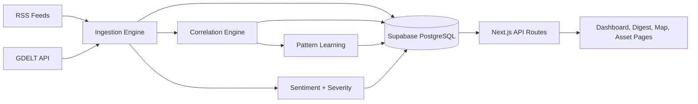

# GeoPulse Intelligence

GeoPulse is a geopolitical intelligence dashboard that connects breaking world events to market reactions. It ingests news, scores severity and sentiment, maps events to stocks and ETFs, and presents the result through a live dashboard, daily digest, world map, and asset detail pages.

[Live App](https://geopolitics-finance-dashboard.vercel.app) | [Setup Guide](docs/setup-guide.md) | [API Reference](docs/api-reference.md) | [Architecture](docs/architecture.md)

## Screenshots

### Dashboard


### Daily Digest


### Global Threat Map


## Why GeoPulse

Financial markets react to conflict, sanctions, energy shocks, elections, and supply-chain disruptions constantly, but most people only see the headline or the price move, not the connection between them.

GeoPulse closes that gap by:

- ingesting geopolitical coverage from RSS sources plus GDELT
- scoring events for severity and sentiment
- linking events to affected assets through a rule-based correlation engine
- learning repeat patterns from historical event-to-asset behavior
- surfacing everything in a product that is readable without a Bloomberg terminal

## What The App Includes

- A live dashboard with event streams, market-impact chips, top movers, and learned pattern insights
- A daily digest view for high-signal summaries and regional/category breakdowns
- A global map that clusters events by country and shows related assets per location
- Stock and ETF detail pages with price context, related events, and pattern confidence
- Personalized onboarding and saved preferences for topics, regions, and symbols
- Manual sync plus scheduled ingestion for keeping the pipeline fresh

## Core Capabilities

### Intelligence Pipeline

- News ingestion from configured RSS feeds plus GDELT
- URL-based deduplication before persistence
- Local sentiment analysis using VADER
- Severity scoring across multiple event signals
- Historical pattern aggregation for repeated event categories and symbols

### Market Correlation Engine

- 113 keyword-to-symbol mappings across major geopolitical themes
- Support for sector ETFs, commodity proxies, country ETFs, and selected equities
- Live quote fetching through Google Finance scraping
- Bi-directional navigation from events to assets and assets back to events

### Product Experience

- Authenticated dashboard experience with preferences
- Interactive world map and regional drill-down
- TradingView embeds on asset pages
- Responsive dark UI optimized for dense information
- Hover metadata for ticker abbreviations so symbol-only views stay understandable

## Tech Stack

- Next.js 16 with the Pages Router
- React 18 and TypeScript
- Prisma ORM
- Supabase PostgreSQL
- NextAuth credentials auth with JWT sessions
- Tailwind CSS
- SWR for data fetching and refresh
- react-simple-maps for the world map
- TradingView embeds for market charts

## Architecture



## Getting Started

### 1. Clone and install

```bash
git clone https://github.com/Sasidhar-7302/Geopolitics_Finance_Dashboard.git
cd Geopolitics_Finance_Dashboard
npm install
```

### 2. Create your environment file

```bash
cp .env.example .env
```

Fill in:

- `DATABASE_URL`
- `DIRECT_URL`
- `NEXTAUTH_SECRET`
- `NEXTAUTH_URL`
- `CRON_SECRET`

### 3. Generate Prisma and prepare the database

```bash
npx prisma generate
npx prisma db push
```

### 4. Run the app

```bash
npm run dev
```

Open `http://localhost:3000`.

## Environment Variables

| Variable | Required | Description |
|---|---|---|
| `DATABASE_URL` | Yes | Supabase pooled connection string, typically port `6543` |
| `DIRECT_URL` | Yes | Supabase direct/session connection string, typically port `5432` |
| `NEXTAUTH_SECRET` | Yes | Secret used to sign NextAuth JWT sessions |
| `NEXTAUTH_URL` | Yes | Local URL in development and deployed URL in production |
| `CRON_SECRET` | Recommended | Secret used to protect the ingestion cron endpoint |

## Vercel + Supabase Deployment

GeoPulse is set up to deploy cleanly on Vercel with Supabase as the database.

### Recommended production setup

1. Set `DATABASE_URL` to the Supabase transaction pooler URL on port `6543`.
2. Set `DIRECT_URL` to the Supabase direct/session URL on port `5432`.
3. Set `NEXTAUTH_URL` to your deployed domain.
4. Set `NEXTAUTH_SECRET` and `CRON_SECRET` in Vercel.
5. Run `npx prisma migrate deploy` against the production database before the first live rollout.

### Cron note

The repository uses a once-per-day Vercel cron schedule by default so Hobby deployments succeed. If you are on a paid Vercel plan and want a more frequent schedule, update `vercel.json` accordingly.

## Project Structure

```text
prisma/
  schema.prisma              Prisma schema
docs/
  api-reference.md           API docs
  architecture.md            System design and flow
  correlation-engine.md      Asset matching logic
  data-pipeline.md           Ingestion and processing
  database-schema.md         Data model reference
  frontend-guide.md          Page and component guide
  market-data.md             Quote and chart integration
  pattern-learning.md        Historical pattern aggregation
  sentiment-analysis.md      VADER and scoring details
  setup-guide.md             Local and deployment setup
  images/                    README screenshots
src/
  components/                Layout, dashboard, and shared UI
  lib/                       Hooks, ingest, auth, sources, scoring, correlation
  pages/                     Routes and API endpoints
```

## API Surface

| Method | Endpoint | Purpose |
|---|---|---|
| GET | `/api/events` | List events with correlations |
| GET | `/api/events/[id]` | Get one event with details |
| GET | `/api/markets/quotes` | Fetch live quote data |
| GET | `/api/stocks/[symbol]` | Get asset-specific news and patterns |
| GET | `/api/patterns` | Read learned market patterns |
| GET | `/api/status` | Pipeline health and aggregate stats |
| POST | `/api/sync` | Trigger a manual ingestion run |
| POST | `/api/cron/ingest` | Trigger scheduled ingestion |

For request and response examples, see [docs/api-reference.md](docs/api-reference.md).

## Documentation Map

- [Architecture](docs/architecture.md)
- [Setup Guide](docs/setup-guide.md)
- [Frontend Guide](docs/frontend-guide.md)
- [Data Pipeline](docs/data-pipeline.md)
- [Correlation Engine](docs/correlation-engine.md)
- [Pattern Learning](docs/pattern-learning.md)
- [Sentiment Analysis](docs/sentiment-analysis.md)
- [Database Schema](docs/database-schema.md)
- [Market Data](docs/market-data.md)
- [API Reference](docs/api-reference.md)

## Product Direction

- [ ] Email or push digest delivery
- [ ] Historical event-pattern timelines
- [ ] Premium AI-assisted event analysis
- [ ] Mobile-first polish and PWA support
- [ ] Expanded alerting and notification workflows

## License

All Rights Reserved.
